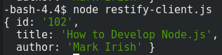

# Tutorial 3: Securing your REST API

The endpoints we created in Tutorial 2 are all well and good, but one major issue is that they are exposed publicly. This means that anyone can send a request to your endpoints, and if the request is formatted correctly, our server will send back information. This may be fine for some endpoints where users are only retrieving data, but could cause serious problems for endpoints that add, update, or delete entries from our DB2 Database.

There are many different ways to secure your REST API, including so-called 'basic authentication' with a username and password, use of an API key, using web tokens, or mechanisms such as OAuth 1 or OAuth 2. For this tutorial, we will use JSON Web Tokens, which are secure tokens that are comprised of a header, a payload, and a signature. I could write a few paragraphs and steal a few images to explain how they work, but this article does a great job of what JWTs are, how they are created, and how they are used \(I highly suggest reading it before continuing\):

[https://medium.com/vandium-software/5-easy-steps-to-understanding-json-web-tokens-jwt-1164c0adfcec](https://medium.com/vandium-software/5-easy-steps-to-understanding-json-web-tokens-jwt-1164c0adfcec)

There are several ways that you can choose to distribute a JWT. One option is to create an API endpoint that allows users to login to your system, and returns a JWT to the user to send with each additional request. Another option is to generate and distribute JWTs to any user you wish to use your system, similar to an API key that they need to access data. This tutorial will cover implementation of the latter, after which point the former should be trivial.

To start, we are going install the final package sof the tutorial, **restify-jwt-community** and **dotenv**. Navigate to the root director of your project and enter the following in the terminal:

```text
npm install --save jsonwebtoken
npm install --save restify-jwt-community
npm install --save dotenv
```

restify-jwt-community will allow us to interact with the JWT in our program in an easier manner, and dotenv allows us to import a secret key from a .env file \(hence the package name\).

In your root director \(the same one that holds your package.json file and node\_modules directory\), create a file called **.env** and add a single line similar to the following \(a key complex enough not to be guessed\):



```text
SECRET_KEY=jsd$8Rg2d9*&4jk3h341@^f$5
```



This secret key can be accessed through the program by calling "process.env.SECRET\_KEY", and will be used to verify JWT tokens that are sent to our server. The content of the secret key should be complex enough that it cannot be guessed by unsavory character This .env file is a good place to store information you don't want to be made public, **as long as you remove the .env file from being tracked by your source control system** \(e.g. add the file to your .gitignore\). Also, the .env file needs to be in the same directory that you are in when you call 'node restify-server.js', meaning that if you are using the git repo, you should navigate to the 'tutorial3' directory before calling node.

Our application is also getting a little unwieldy, so we are going to take the opportunity to make it more modular. For our restifty server, our primary file will still be **restify-server.js**, a place where we declare our endpoints \(we will define their functionality elsewhere\) and start the server. We will take our code for connecting to the database and put it in its own file, **database.js,** and export the connection so we can use it in all of our other files. Finally, we will group endpoint functions into separate files, in this case **books.js** \(for manipulating our book data\) and **auth.js** \(for authorizing a username and password and retrieving a JWT token\).



```javascript
require('dotenv').config();

const restify = require('restify');
const errors = require('restify-errors');

const restifyJwt = require('restify-jwt-community');
const jwt = require('jsonwebtoken');

const auth = require('./auth');
const books = require('./books');

// setting up the RESTify server
let server = restify.createServer();
server.use(restify.plugins.bodyParser());

server.use(restifyJwt({ "secret": process.env.SECRET_KEY }).unless({
  path: ['/auth/']
}));

// API ROUTES

// Auth
server.post('/auth/', auth.authorize);
// Books
server.get('/books/:id', books.getBook);
server.post('/books/', books.postBook);

// Start the server
server.listen(3030, function() {
  console.log('%s listening at %s', server.name, server.url);
});
```



restify-server.js sets up our restify server, first by creating a server \(line 13\), then declaring our middleware \(lines 14 and 16\), declaring our REST API endpoints \(lines 23 to 26\), and then launching the server on port 3030 \(line 29\). The newest and most important part for securing our API is telling our server to use restifyJwt, passing in a secret that is used to authenticate passed JWTs. Remember, we defined SECRET\_KEY in our .env file, and here we call it without exposing the actual key value to the outside world \(as long as you followed my instructions and added .env to your .gitignore file\). By using our restifyJwt object as middleware \(excluding our /auth/ endpoint\), we require a JWT to be able to access anything on our server. Note that our routes are declared, with the functions declared in files auth.js and books.js and merely required here. This helps use keep our code modular and clean, instead of declaring everything in one large unmanageable file. Before getting to our auth.js file, it is important to look at our database file, where we create a connection and then export it:



```javascript
const idb = require('idb-pconnector');

const SCHEMA = 'MARK';
let idbConnection = new idb.Connection().connect();

setupDatabase();

async function setupDatabase() {

  // setting up the database tables
  try {
    var dbStatement = idbConnection.getStatement();
    await dbStatement.exec("SET schema " + SCHEMA);
    await dbStatement.exec("CREATE OR REPLACE TABLE BOOKS(ID INTEGER NOT NULL GENERATED ALWAYS AS IDENTITY (START WITH 1 INCREMENT BY 1), TITLE VARCHAR(32) NOT NULL, AUTHOR VARCHAR(32), PRIMARY KEY (ID))");
    await dbStatement.exec("CREATE OR REPLACE TABLE USERS(USERNAME VARCHAR(32) NOT NULL, PASSWORD VARCHAR(32) NOT NULL)");
    await dbStatement.exec("INSERT INTO USERS VALUES('Mark', 'pass123')");
  } catch (dbError) {
    console.error("Error is " + dbError);
  } finally {
    dbStatement.close();
  }
}

module.exports.idb = idb;
module.exports.connection = idbConnection;
```



database.js requires our idb-pconnector package that allows us to interact with the DB2 database on our IBMi. We then open our connection \(line 4\) and eventually export it so it can be used by other files \(line 25\). In between we set up our database for this example by creating two new tables \(BOOKS and USERS\) and adding a single user into USER, with USERNAME = 'Mark' and PASSWORD = 'pass123'. These are the credentials we will later use to log into the API and get a JWT.

In our auth.js file, we declare our logic for distributing a JWT:



```javascript
let idb = require('./database').idb
let idbConnection = require('./database').connection;
const jwt = require('jsonwebtoken');

module.exports = {

    authorize: async function(req, res, next) {

        let { username, password } = req.body;

        await authenticate(username, password).then(data => {

            let token = jwt.sign(data, process.env.SECRET_KEY, {
                expiresIn: '15m' // token expires in 15 minutes
            });

            res.send({ token });
            next();

        }).catch(function(error) {
            res.send(error);
            next();
        });
    }
}

// helper function, not exported
async function authenticate(username, password) {

    let dbStatement;

    dbStatement = await idbConnection.getStatement();
    await dbStatement.prepare("SELECT * FROM MARK.USERS WHERE USERNAME = ? AND PASSWORD = ?");
    await dbStatement.bind([ [username, idb.SQL_PARAM_INPUT, idb.SQL_BIND_CHAR], [password, idb.SQL_PARAM_INPUT, idb.SQL_BIND_CHAR]]);
    await dbStatement.execute();
    let user = await dbStatement.fetch();
    if (user) {
        return { username: user["USERNAME"] };
    } else {
        throw Error("Couldn't log you on. Check your credentials and try again");
    }
    dbStatement.close();
}

```



Note that we import our database connection on line 2, allowing use to use the connection we opening in database.js \(in fact, Node.js will export the same copy of a module/object using 'exports' and 'require', allowing us to share this object across multiple files\).

We also define the authorize function, which we use in the declaration of "post.\('/auth/', auth.authorize\)" endpoint in the restify-server.js file. Our authorize function here gets the username and password passed in the request body \(which we will see in our restify-client.js\), then calls the local 'authenticate' function to make sure the credentials match those in our database. If so, we return the username \(which becomes part of our JWT on line 13\),  and we send the token back to the client. The client can then attach this token to every other request they make, letting the server know they are authenticated. If you need more granularity, you can add other fields to the JWT, such as a key to let the server know what endpoints the user is authorized for.

We also have a books.js, but there isn't much special about it. It simply exposes getBook and postBook functions that are mapped to GET '/books/{id}' and POST '/books/' respectively that allow us to access the BOOKS table we created in database.js. I post it here only for completeness sake, but won't spend the characters to explain like I do for the above files:



```javascript
let idb = require('./database').idb
let idbConnection = require('./database').connection;

module.exports = {

    getBook: async function(req, res, next) {

        let id = req.params.id;
        let dbStatement; 
        
        try {
            dbStatement = idbConnection.getStatement();
            var result = await dbStatement.exec("SELECT * FROM BOOKS WHERE ID = " + req.params.id +";");
            if (result.length > 0) {
            let responsePayload = { id: id, title: result[0]["TITLE"], author: result[0]["AUTHOR"] };
            res.send(responsePayload);
            } else {
            return next(new errors.NotFoundError("Could not find book with id " + id + " in the database."));
            }
        } catch (dbError) {
            console.error("Error is " + dbError);
            return next(new errors.InternalServerError("Internal Server Error"));
        } finally {
            dbStatement.close();
        }
        
        next();
    },

    postBook: async function(req, res, next) {

        // the body of the request should be in the format { title: 'title', author: 'author' }
        let payload = req.body;
        if (!(payload.hasOwnProperty('title') && payload.hasOwnProperty('author'))) {
            return next(new errors.BadRequestError("Your request wasn't formatted correctly. Pass a title and an author"));
        }

        let dbStatement; 
        try {
            dbStatement =  idbConnection.getStatement();

            let payload = req.body;

            // insert the book into the database
            await dbStatement.prepare("SELECT ID FROM FINAL TABLE(INSERT INTO BOOKS(TITLE, AUTHOR) VALUES(?, ?));");
            await dbStatement.bind([ [payload.title, idb.SQL_PARAM_INPUT, idb.SQL_BIND_CHAR], [payload.author, idb.SQL_PARAM_INPUT, idb.SQL_BIND_CHAR]]);
            await dbStatement.execute();
            let id = await dbStatement.fetch();
            await dbStatement.commit();

            // get the id from the new book, return it to the caller
            res.send( { id: id.ID });

        } catch (dbError) {
            console.error("Error is " + dbError);
            return next(new errors.InternalServerError("Internal Server Error"));
        } finally {
            dbStatement.close();
        }

        next();
    }
}
```



And that's our restify server! We created three endpoints, one which allows the user to log in and obtain a JWT, and two which allow access to our database and require the JWT we obtained. Our API is now secure, and we can test it with a simple restify client:



```javascript
var clients = require('restify-clients');

var client = clients.createJsonClient({
    url: 'http://localhost:3030',
    version: '*'
});

let token = null;

client.post('/auth/', { username: 'Mark', password: 'pass123' }, function(err, req, res, obj) {

    if (err) { console.error(err); return; }

    token = obj.token;

    let options = {
        path: '/books/',
        headers: {
            'Authorization': "Jwt " + token
        }
    }


    client.post(options, { title: "How to Develop Node.js", author: "Mark Irish" }, function(err, req, res, obj) {
        if (err) { console.error(err); return; }
    
        let options = {
            path: '/books/' + obj.id,
            headers: {
                'Authorization': "Jwt " + token
            }
        }

        client.get(options, function(err, req, res, obj) {
            if (err) { console.error(err); return; }

            console.log(obj);
        })
    
    });
});
```



In this simple restify client, we create a JSON client \(line 3\), then post to the '/auth/' endpoint with the username and password that we added to the USERS table when we initialized our database connection. The return object 'obj' contains a field 'token' that contains the JWT token returned from the server. We then attach that token to the  header of our next requests \(lines 19 and 30\). Note that the restify JWT packages we use expect the Header to be in the format "Authoriation": "Jwt \[token\]". We then post a book to the database called "How to Develop Node.js", authored by yours truly \(not really, these tutorials are the closest I've ever gotten!\). If that post was successful, we are returned the id for the new book, which we can then use to call the GET '/books/{id}' endpoint and confirm that our book was added.



To run the example, navigate to the tutorial3 directory and run:

`node restify-server.js`

You should see output indicating the restify is listening on port 3030. Then, in a new terminal, navigate to the same directory and run:

`node restify-client.js.`

You client should hit your server, and you should get output similar to above.

And with that, we have used Node.js, restify, and JWT and turned our IBM i into a REST server, than can be accessed by a REST client, a program such as Postman, or an in-terminal utility like curl!

